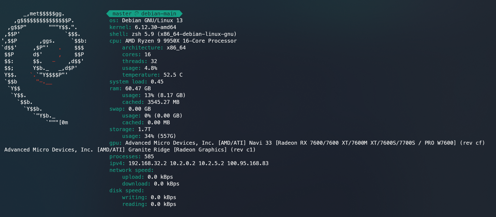

# Sysfetch
Command-line system information tool written in Python.\
Features hardware and operative system centered information.



Inspired by Neofetch and PowerLevel10k

## Install 
To install sysfetch in your system, you need to execute "install.sh" file:

```commandline
$ ./install.sh
```

At a certain point you will be prompted for your password, in order to give root privilegies to the script,
please DO NOT execute it as root beforehand.\
The script will create a folder called "sysfetch" in "/usr/share", and will copy "distros.py" into it. \
The "sysfetch" main script will be copied into "/usr/local/bin".\
A new fodler will be created in your home directory, in which there will be stored the configuration file and the cache file.

It is also required to have installed the package "psutil", 
which can be installed both by your distro's package manager or
by pip

```commandline
$ pip install psutil
```

## Usage

```commandline
$ sysfetch
```
To decrease execution time, Sysfetch implements a cacheing method, 
which locally stores all "static" data featured.

If you want data to be recached, in case you changed something in 
your device which concerns "static" data, simply use:

```commandline
$ sysfetch recache
```
It is a good practice to recache at least once a week.

If you desire to use a color different from default one (purple), 
you can change it by:

```commandline
$ sysfetch color aquagreen
```

Available colors:
- grey
- red
- yellow
- purple
- green
- lightblue
- blue
- orange
- aquagreen

To get help about usage, it is available the "--help" option:

```commandline
$ sysfetch --help
```


If you wish to set a personalised default behaviour, you can edit the configurartion file
located in "$HOME/.sysfetch/conf.json". Example configuration:

```json
{
  "ascii-art" : "debian",
  "separator-unicode" : "debian",
  "default-color" : "aquagreen",
  "always-recache" : false
}
```

Leave blank if you want to keep the standard behaviour.

Once done with conf.json, to load your changes it is required to recache.

Available always-recache values:
- true
- false

Available separator unicode:
- alpine
- macos
- arch
- debian
- kali
- parrot
- endeavour
- raspbian
- manjaro
- centos
- opensuse
- redhat
- sabayon
- slackware
- mandriva
- mangeia
- devuan
- tux

Available colors:
- grey
- red
- yellow
- purple
- green
- lightblue
- blue
- orange
- aquagreen

Available ascii-art:
 - armbian
 - aix
 - alpine
 - alterlinux
 - anarchy
 - android
 - antergos
 - antix
 - aosc os
 - aosc os/retro
 - apricity
 - arcolinux
 - archbox
 - archlabs
 - archstrike
 - xferience
 - archmerge
 - arch
 - artix
 - arya
 - bedrock
 - bitrig
 - blackarch
 - blag
 - blankon
 - bluelight
 - bonsai
 - bsd,bunsenlabs
 - calculate
 - carbs
 - centos
 - chakra
 - chaletos
 - chapeau
 - chrom
 - cleanjaro
 - clearos
 - clear_linux
 - clover
 - condres
 - container_linux
 - crux
 - cucumber
 - debian
 - deepin
 - desaos
 - devuan
 - dracos
 - darkos
 - dragonfly
 - drauger
 - elementary
 - endeavouros
 - endless
 - eurolinux
 - exherbo
 - fedora
 - feren
 - freebsd
 - freemint
 - frugalware
 - funtoo
 - galliumos
 - garuda
 - gentoo
 - pentoo
 - gnewsense
 - gnome
 - gnu
 - gobolinux
 - grombyang
 - guix
 - haiku
 - huayra
 - hyperbola
 - janus
 - kali
 - kaos
 - kde_neon
 - kibojoe
 - kogaion
 - korora
 - kslinux
 - kubuntu
 - lede
 - lfs
 - linux_lite
 - lmde
 - lubuntu
 - lunar
 - macos
 - mageia
 - magpieos
 - mandriva
 - manjaro
 - maui
 - mer
 - minix
 - linuxmint
 - mx_linux
 - namib
 - neptune
 - netbsd
 - netrunner
 - nitrux
 - nixos
 - nurunner
 - nutyx
 - obrevenge
 - openbsd
 - openeuler
 - openindiana
 - openmamba
 - openmandriva
 - openstage
 - openwrt
 - osmc
 - oracle
 - os elbrus
 - pacbsd
 - parabola
 - pardus
 - parrot
 - parsix
 - trueos
 - pclinuxos
 - peppermint
 - popos
 - porteus
 - postmarketos
 - proxmox
 - puppy
 - pureos
 - qubes
 - radix
 - raspbian
 - reborn_os
 - redstar
 - redcore
 - redhat
 - refracted_devuan
 - regata
 - rosa
 - sabotage
 - sabayon
 - sailfish
 - salentos
 - scientific
 - septor
 - serenelinux
 - sharklinux
 - siduction
 - slackware
 - slitaz
 - smartos
 - solus
 - source_mage
 - sparky
 - star
 - steamos
 - sunos
 - opensuse_leap
 - opensuse_tumbleweed
 - opensuse
 - swagarch
 - tails
 - trisquel
 - ubuntu-budgie
 - ubuntu-gnome
 - ubuntu-mate
 - ubuntu-studio
 - ubuntu
 - venom
 - void
 - obarun
 - windows10
 - windows7
 - xubuntu
 - zorin
 - irix
 - tux