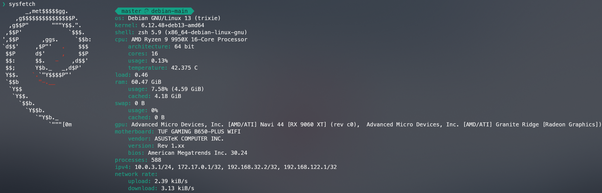

# Sysfetch
Command-line system information tool written in Python.\
Features hardware and operative system centered information.



Inspired by Neofetch and PowerLevel10k

## Install 
Required packages: `python3 python3-pip python3-venv`

To install sysfetch in your system, you need to execute "install.sh" file:

```commandline
$ ./install.sh full
$ ./install.sh update
```

The installation script needs a parameter, which can either be "full" or "update":
- if you choose "full": 
  - Sysfetch source code gets compiled into an executable 
  - The "sysfetch" executable will be copied into "/usr/local/bin"
  - A new folder named ".sysfetch" will be created in your home directory, in which there will be stored the configuration file
- if you choose "update":
  - Sysfetch source code gets compiled into an executable 
  - The "sysfetch" executable will be copied into "/usr/local/bin"

At a certain point you will be prompted for your password, in order to give root privileges to the script. \
It is not suggested to run `install.sh` script as root, at it is blocked by default; hoewver it is possible to do so giving `--force` as first argument  

## Usage

```commandline
$ sysfetch
```

To ignore your configuration file:
```commandline
sysfetch ignore-conf
```
Similarly to "no-ascii-art", if you give the parameter "ignore-conf", its output will be cached. Use "recache" parameter to restore configuration 

To get help about usage, it is available the "--help" option:

```commandline
$ sysfetch --help
```

If you wish to set a personalised default behaviour, you can edit the configuration file
located in `$HOME/.sysfetch/conf.yaml`.

Default configuration:

```yaml
ascii-art: default
color: default
unicode-logo: default

os: yes
kernel: yes
shell: yes
cpu: yes
cpu-arch: yes
cpu-cores: yes
cpu-usage: yes
cpu-temp: yes

load: yes

ram: yes
ram-usage: yes
ram-cached: yes

swap: yes
swap-usage: yes
swap-cached: yes

gpu: yes

motherboard: yes
motherboard-vendor: yes
motherboard-version: yes
motherboard-bios: yes

processes: yes

ipv4: yes

net-rate: yes
```
Setting as `no` any of the values, removes the corresponding element from the displayed information. \
Leave `yes` if you want to keep the standard behaviour.

Available separator unicode:
- `default`
- alpine
- macos
- arch
- debian
- kali
- parrot
- endeavour
- raspbian
- manjaro
- centos
- opensuse
- redhat
- sabayon
- slackware
- mandriva
- mangeia
- devuan
- tux

Available colors:
- `default`
- grey
- red
- yellow
- purple
- green
- lightblue
- blue
- orange
- aquagreen

Available ascii-art:
- `default`
 - armbian
 - aix
 - alpine
 - alterlinux
 - anarchy
 - android
 - antergos
 - antix
 - aosc os
 - aosc os/retro
 - apricity
 - arcolinux
 - archbox
 - archlabs
 - archstrike
 - xferience
 - archmerge
 - arch
 - artix
 - arya
 - bedrock
 - bitrig
 - blackarch
 - blag
 - blankon
 - bluelight
 - bonsai
 - bsd,bunsenlabs
 - calculate
 - carbs
 - centos
 - chakra
 - chaletos
 - chapeau
 - chrom
 - cleanjaro
 - clearos
 - clear_linux
 - clover
 - condres
 - container_linux
 - crux
 - cucumber
 - debian
 - deepin
 - desaos
 - devuan
 - dracos
 - darkos
 - dragonfly
 - drauger
 - elementary
 - endeavouros
 - endless
 - eurolinux
 - exherbo
 - fedora
 - feren
 - freebsd
 - freemint
 - frugalware
 - funtoo
 - galliumos
 - garuda
 - gentoo
 - pentoo
 - gnewsense
 - gnome
 - gnu
 - gobolinux
 - grombyang
 - guix
 - haiku
 - huayra
 - hyperbola
 - janus
 - kali
 - kaos
 - kde_neon
 - kibojoe
 - kogaion
 - korora
 - kslinux
 - kubuntu
 - lede
 - lfs
 - linux_lite
 - lmde
 - lubuntu
 - lunar
 - macos
 - mageia
 - magpieos
 - mandriva
 - manjaro
 - maui
 - mer
 - minix
 - linuxmint
 - mx_linux
 - namib
 - neptune
 - netbsd
 - netrunner
 - nitrux
 - nixos
 - nurunner
 - nutyx
 - obrevenge
 - openbsd
 - openeuler
 - openindiana
 - openmamba
 - openmandriva
 - openstage
 - openwrt
 - osmc
 - oracle
 - os elbrus
 - pacbsd
 - parabola
 - pardus
 - parrot
 - parsix
 - trueos
 - pclinuxos
 - peppermint
 - popos
 - porteus
 - postmarketos
 - proxmox
 - puppy
 - pureos
 - qubes
 - radix
 - raspbian
 - reborn_os
 - redstar
 - redcore
 - redhat
 - refracted_devuan
 - regata
 - rosa
 - sabotage
 - sabayon
 - sailfish
 - salentos
 - scientific
 - septor
 - serenelinux
 - sharklinux
 - siduction
 - slackware
 - slitaz
 - smartos
 - solus
 - source_mage
 - sparky
 - star
 - steamos
 - sunos
 - opensuse_leap
 - opensuse_tumbleweed
 - opensuse
 - swagarch
 - tails
 - trisquel
 - ubuntu-budgie
 - ubuntu-gnome
 - ubuntu-mate
 - ubuntu-studio
 - ubuntu
 - venom
 - void
 - obarun
 - windows10
 - windows7
 - xubuntu
 - zorin
 - irix
 - tux
