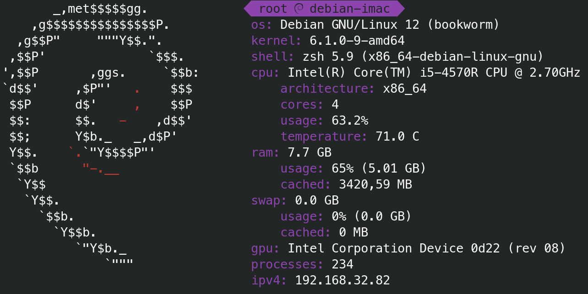

# Sysfetch
Command-line system information tool written in Python.\
Features hardware and operative system centered information.

Inspired by Neofetch and PowerLevel10k

Currently still in beta-testing phase. Feel free to test the software and report any bad behaviour 

### Install 
To install sysfetch in your system, you need to execute "install.sh" file with root privilegies:

```commandline
$ ./install.sh
```

The script will create a folder called "sysfetch" in "/usr/share", and will copy "distros.py" into it. \
The "sysfetch" main script will be copied into "/usr/local/bin".

It is also required to have installed the package "psutil", 
which can be installed both by your distro's package manager or
by pip

```commandline
$ pip install psutil
```

### Usage

```commandline
$ sysfetch
```
To decrease execution time, Sysfetch implements a cacheing method, 
which locally stores all "static" data featured.

If you want data to be recached, in case you changed something in 
your device which concerns "static" data, simply use:

```commandline
$ sysfetch recache
```
It is a good practice to recache at least once a week.

If you desire to use a color different from default one (purple), 
you can change it by:

```commandline
$ sysfetch color aquagreen
```

Available colors:
- grey
- red
- yellow
- purple
- green
- lightblue
- blue
- orange
- aquagreen

### Example:
